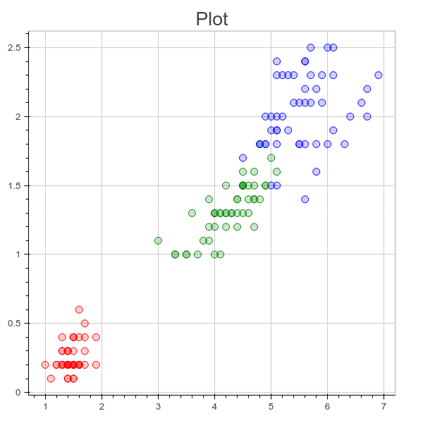

# Blaze Server

Blaze server exposes Python data through a JSON web API

*  Easily spin up a data server
*  Interact with that server through JSON
*  Support many data resources (Lists, DataFrames, SQL databases, Hadoop clusters)
*  Interact with server with Blaze on client side


### Server

Host data with Blaze Server

```Python
>>> from blaze import *
>>> csv = CSV('examples/data/iris.csv')

>>> from blaze.server import Server
>>> server = Server({'iris': csv})
>>> server.app.run(host='0.0.0.0', port=5000)
```

### Client

Query data through JSON API

```
$ curl \
    -H "Content-Type: application/json" \
    -d '{"expr": "iris"}' \
    localhost:5000/compute/iris.json
{
  "data": [
    [
      5.1,
      3.5,
      1.4,
      0.2,
      "Iris-setosa"
    ],
    [
      4.9,
      3.0,
      1.4,
      0.2,
      "Iris-setosa"
    ],
```


### Server

Host data with Blaze Server

```Python
>>> from blaze import *
>>> csv = CSV('examples/data/iris.csv')

>>> from blaze.server import Server
>>> server = Server({'iris': csv})
>>> server.app.run(host='0.0.0.0', port=5000)
```

### Client

Interact through Python (or any language)

```Python
>>> import json
>>> import requests

>>> query = {'expr': 'iris'}

>>> response = requests.get('http://localhost:5000/compute/iris.json',
...                         data=json.dumps(query),
...                         headers={'Content-Type': 'application/json'})

>>> json.loads(response.content)
{u'data': [[5.1, 3.5, 1.4, 0.2, u'Iris-setosa'],
  [4.9, 3.0, 1.4, 0.2, u'Iris-setosa'],
  [4.7, 3.2, 1.3, 0.2, u'Iris-setosa'],
  [4.6, 3.1, 1.5, 0.2, u'Iris-setosa'],
  [5.0, 3.6, 1.4, 0.2, u'Iris-setosa'],
...
```


### Server

Host data with Blaze Server

```Python
>>> from blaze import *
>>> csv = CSV('examples/data/iris.csv')

>>> from blaze.server import Server
>>> server = Server({'iris': csv})
>>> server.app.run(host='0.0.0.0', port=5000)
```

### Client

Interact from web applications


```


### Server

Host data with Blaze Server

```Python
>>> from blaze import *
>>> csv = CSV('examples/data/iris.csv')

>>> from blaze.server import Server
>>> server = Server({'iris': csv})
>>> server.app.run(host='0.0.0.0', port=5000)
```

### Client

Send computations to the server

```Python
>>> import json
>>> import requests

>>> query = {'expr': {'op': 'Column', 'args': ['iris', 'petal_length']}}

>>> response = requests.get('http://localhost:5000/compute/iris.json',
...                         data=json.dumps(query),
...                         headers={'Content-Type': 'application/json'})

>>> json.loads(response.content)
{u'data': [1.4,
  1.4,
  1.3,
  1.5,
  1.4,
  1.7,
...
```


### Server

Host data with Blaze Server

```Python
>>> from blaze import *
>>> csv = CSV('examples/data/iris.csv')

>>> from blaze.server import Server
>>> server = Server({'iris': csv})
>>> server.app.run(host='0.0.0.0', port=5000)
```

### Client

Generate computations with symbolic Blaze

```Python
>>> from blaze import *
>>> t = TableSymbol('t', '{ sepal_length : ?float64, sepal_width : ?float64, petal_length : ?float64, petal_width : ?float64, species : string }')

>>> expr = by(t.species,                # more complex query to send to server
...           min=t.petal_length.min(),
...           max=t.petal_length.max())

>>> from blaze.server import to_tree
>>> to_tree(expr, names={t: 'iris'})
{'args': [{'args': ['iris', 'species'], 'op': 'Column'},
  {'args': [{'args': ['iris', 'petal_length'], 'op': 'Column'},
    ['max', 'min'],
    [{'args': [{'args': ['iris', 'petal_length'], 'op': 'Column'}],
      'op': 'max'},
     {'args': [{'args': ['iris', 'petal_length'], 'op': 'Column'}],
      'op': 'min'}]],
   'op': 'Summary'}],
  'op': 'By'}

...
```


### Server

Host data with Blaze Server

```Python
>>> from blaze import *
>>> csv = CSV('examples/data/iris.csv')

>>> from blaze.server import Server
>>> server = Server({'iris': csv})
>>> server.app.run(host='0.0.0.0', port=5000)
```

### Client

Or drive a remote server from a Python Client

```Python
>>> from blaze import *
>>> from blaze.server import *

>>> t = Table('blaze://localhost:5000::iris')
>>> t.head(3)
    sepal_length  sepal_width  petal_length  petal_width      species
0            5.1          3.5           1.4          0.2  Iris-setosa
1            4.9          3.0           1.4          0.2  Iris-setosa
2            4.7          3.2           1.3          0.2  Iris-setosa

>>> by(t.species, min=t.petal_length.min(), max=t.petal_length.max())
           species  max  min
0   Iris-virginica  6.9  4.5
1      Iris-setosa  1.9  1.0
2  Iris-versicolor  5.1  3.0
```


### Server

Operate on any Blaze supported type

```Python
>>> from blaze import *
>>> csv = CSV('examples/data/iris.csv')
>>> df = into(DataFrame, csv)

>>> from blaze.server import Server
>>> server = Server({'iris': df})
>>> server.app.run(host='0.0.0.0', port=5000)
```

### Client

Or just drive a remote server

```Python
>>> from blaze import *
>>> from blaze.server import *

>>> t = Table('blaze://localhost:5000::iris')
>>> t.head(3)
    sepal_length  sepal_width  petal_length  petal_width      species
0            5.1          3.5           1.4          0.2  Iris-setosa
1            4.9          3.0           1.4          0.2  Iris-setosa
2            4.7          3.2           1.3          0.2  Iris-setosa

>>> by(t.species, min=t.petal_length.min(), max=t.petal_length.max())
           species  max  min
0   Iris-virginica  6.9  4.5
1      Iris-setosa  1.9  1.0
2  Iris-versicolor  5.1  3.0
```


### Server

Operate on any Blaze supported type

```Python
>>> from blaze import *
>>> import pymongo
>>> db = pymongo.MongoClient().db

>>> from blaze.server import Server
>>> server = Server({'iris': db.iris_collection})
>>> server.app.run(host='0.0.0.0', port=5000)
```

### Client

Or just drive a remote server

```Python
>>> from blaze import *
>>> from blaze.server import *

>>> t = Table('blaze://localhost:5000::iris')
>>> t.head(3)
    sepal_length  sepal_width  petal_length  petal_width      species
0            5.1          3.5           1.4          0.2  Iris-setosa
1            4.9          3.0           1.4          0.2  Iris-setosa
2            4.7          3.2           1.3          0.2  Iris-setosa

>>> by(t.species, min=t.petal_length.min(), max=t.petal_length.max())
           species  max  min
0   Iris-virginica  6.9  4.5
1      Iris-setosa  1.9  1.0
2  Iris-versicolor  5.1  3.0
```
