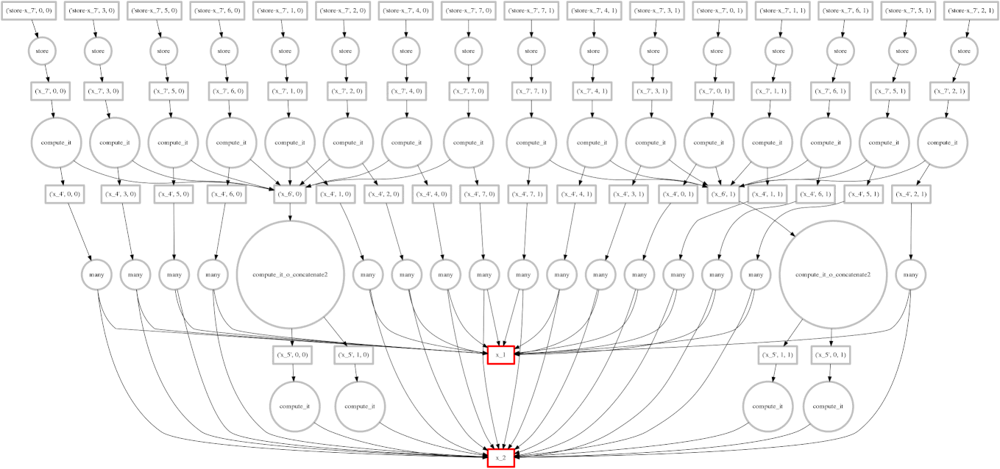

`distributed`
-------------

*Matthew Rocklin*

[distributed.readthedocs.org](http://distributed.readthedocs.org/en/latest/)

### Dynamic distributed task scheduler

### with dask and concurrent.futures user interfaces

### call many python functions on a cluster

### moving data as necessary

### Why we care -- as a community

*   Some people have large problems

    (big data, or big computation)
*   Complex analytics (ndarrays, machine learning, statistics)

    don't easily fit existing abstractions (MapReduce/Spark)
*   Few distributed abstractions exist outside the JVM

    (but most analytics do!)

### Why we care -- as a company

*  Slow energy drain over to JVM stack
*  Customers seem to like distributed computing
*  It's hip!

### Dynamic distributed task scheduler

### with dask and concurrent.futures user interfaces

### Task Scheduling

### Task Scheduling

### Task Scheduling

### call many python functions on a cluster

### moving data as necessary

### Schedulers execute task graphs

*  **Single Machine:** `dask.threaded`
    *  Fit in memory  (hard)
    *  Use all of our cores  (easy)
*  **Distributed Machine:** `distributed.scheduler`
    *  Fit in memory  (easy)
    *  Use all of our cores  (medium)
    *  Avoid communication  (hard)

### Distributed adds some other stuff too

*  Fully asynchronous
    *  Can add new tasks during computation
    *  A bit smoother user experience
*  Multi-user support
*  Non-lazy `concurrent.futures` API
*  Base to build other distributed projects

### Distributed: basic architecture and local setup

*  Center (single): Coordination point
*  Workers (many): Store data, perform computations
*  Scheduler (single): Orchestrates workers
*  Executor (few): Mediate between user and Scheduler

    $ pip install distributed --upgrade

    $ dcenter
    distributed.dcenter - INFO - Start center at 192.168.1.106:8787

    <New Terminal>
    $ dworker 127.0.0.1:8787   # run this in a few terminals
    distributed.worker - INFO - Start worker at             192.168.1.106:8789
    distributed.worker - INFO - Registered with center at:  127.0.0.1:8787

    <New Terminal>
    $ dworker 127.0.0.1:8787   # run this in a few terminals

Verify that the center and workers shake hands in log messages

### Concurrent.futures

    >>> from concurrent.futures import ThreadPoolExecutor
    >>> executor = ThreadPoolExecutor(4)  # four threads

    >>> def inc(x):
            return x + 1

    >>> future = executor.submit(inc, 1)  # run inc(1) in thread
    >>> future
    <Future at 0x7f831983cc50 state=finished returned int>

    >>> future.result()  # block, return result when finished
    2

### Concurrent.futures

**Use `map` for embarrassingly parallel tasks**

    filenames = glob('2015-*-*.log')
    L = executor.map(process_file, filenames)  # Common case

**Use `submit` for more complex analyis**

    filenames = glob('INET-*.csv')
    timeseries_list = executor.map(pd.read_csv, filenames)

    def func(df1, df2):
        return df1.volume.corr(df2.volume)

    correlations = [[executor.submit(func, df1, df2) for df1 in timeseries_list]
                                                     for df2 in timeseries_list]

    correlations = [[future.result() for future in inner_list] # block
                                     for inner_list in correlations]

### Problem with `Future.result()`

We explicitly wait and gather futures

    a = executor.submit(f, x)       # Run two functions in parallel
    b = executor.submit(f, y)       # Run two functions in parallel

    a2 = a.result()                 # Wait until both functions finish
    b2 = b.result()                 # Wait until both functions finish

    c = executor.submit(g, a2, b2)  # Run new function on gathered results
    c.result()

We would prefer to ignore this step

    a = executor.submit(f, x)       # Run two functions in parallel
    b = executor.submit(f, y)       # Run two functions in parallel

    c = executor.submit(g, a, b)    # Scheduler determines when safe to run g
    c.result()

*  Avoid collecting results mid-computation
*  Trust scheduler to run tasks when ready

### Use Distributed: concurrent.futures

    from distributed import Executor
    executor = Executor('127.0.0.1:8787')

    def inc(x):
        return x + 1

    def add(x, y):
        return x + y

    a = executor.submit(inc, 1)
    b = executor.submit(inc, 100)

    c = executor.submit(add, a, b)
    c.result()

### Full API

    e = Executor(address)

    future  = e.submit(func, *args, **kwargs)    # Single function call
    futures = e.map(func, *iterables, **kwargs)  # Multiple function calls

    futures = e.scatter(data)                    # Send data out to network
    data    = e.gather(futures)                  # Gather data to local process

    data    = e.get(dsk, keys)                   # Dask compatible get function
    futures = e.compute(dask_collections)        # Asynchronous dask function

    e.restart()
    e.upload_file(filename)
    progress(futures)
    wait(futures)

### Use Distributed: dask

    >>> from distributed import Executor
    >>> executor = Executor('127.0.0.1:8787')

    >>> import dask.array as da
    >>> x = da.random.random((10000, 10000), chunks=(1000, 1000))

    >>> y = x.mean()
    >>> y.compute(get=executor.get)      # Immediate execution
    0.50001713553447302

    >>> executor.compute(y)  # Asynchronous execution
    [<Future: status: finished, key: finalize-4fcca230d2098922b342>]

## Internals

### Internals - Network

### Distributed

*   **Event driven:** responds to and recovers from stimuli
*   **Centralized control:** sophisticated scheduler, dumb workers
*   **Low latency:** operations run in linear time, 1ms overhead
*   **Asynchronous:** user API rarely blocks

### Internals - Communication

*   Everything is a TCP Server
*   Raw sockets wrapped by tornado streams
*   Tornado coroutines for concurrency (like safe threads)
*   Cloudpickle Python dicts

        {'op': 'compute', 'func': inc, 'args': (1,)}

    separated by sentinel bytestring

### [example](http://distributed.readthedocs.org/en/latest/foundations.html#example)

### Relevant state and operations

*  Center:
    * who_has:: `{key: [workers]}`
    * has_what:: `{worker: [keys]}`
    * Information about workers
*  Worker
    * data:: ``{key: object}``
    * ThreadPool
    * compute()
*  Nanny
    * Worker process
    * kill()
    * monitor_resources()
*  Scheduler
    * [... see docs](http://distributed.readthedocs.org/en/latest/scheduler.html)

### [Scheduler](http://distributed.readthedocs.org/en/latest/scheduler.html)

### User Feedback - Michael Broxton

*  Good
    *   dask + distributed transitions smoothly from shared-memory threads to
        cluster
    *   Documentation and test coverage are great
    *   asynchronous execution is innovative, hopes it spreads to other parts
        of PyData
*  Bad
    *   Networking and errors don't seem completely reliable.  Errors aren't
        always graceful.  Hesitate to fully replace Spark toolchain.
    *   Diagnostics not ready.  Excited about granular reporting though.
    *   Will probably eventually require a shuffle
*  Surprising
    *   Surprised to need a separate project (dask) to write down complex
        lazy computations
    *   Tripped up in dask.imperative syntax once

### Ongoing work

*   Diagnostics and visualizations
*   Clean error reporting
*   Refactor Scheduler
    *   Multi-user
    *   Remote Scheduler
    *   Remove dead code
*   Message compression, headers, protocol
*   Work stealing / rebalancing
*   Need a new name
*   Find next round of proto-users

### Potential work

*   Distributed shuffle (needed for fancy database operations)
*   Language agnostic Scheduler (R workers or Go scheduler)
*   Fancier scheduling (many possibilities)
